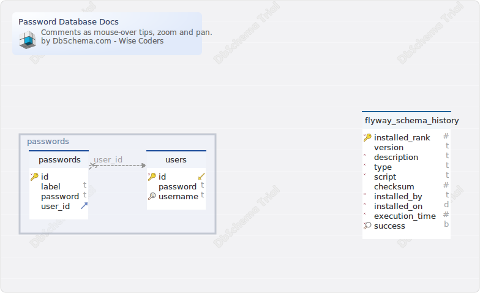

#Password Database Docs
Generated using [DbSchema](https://dbschema.com)

### Main Layout

### Table public.passwords 
| | | |
|---|---|---|
| * &#128273;  | id| uuid  |
|  | label| varchar(255)  |
|  | password| varchar(255)  |
| &#11016; | user\_id| uuid  |

##### Indexes 
| | | |
|---|---|---|
| &#128273;  | passwords\_pkey | ON id|

##### Foreign Keys
| | | |
|---|---|---|
|  | fkqiupw3oqiukdfyc45xvoky044 | ( user\_id ) ref [public.users](#users) (id) |

### Table public.users 
| | | |
|---|---|---|
| * &#128273;  &#11019; | id| uuid  |
|  | password| varchar(255)  |
| &#128269; | username| varchar(255)  |

##### Indexes 
| | | |
|---|---|---|
| &#128273;  | users\_pkey | ON id|
| &#128269;  | uk\_r43af9ap4edm43mmtq01oddj6 | ON username|

